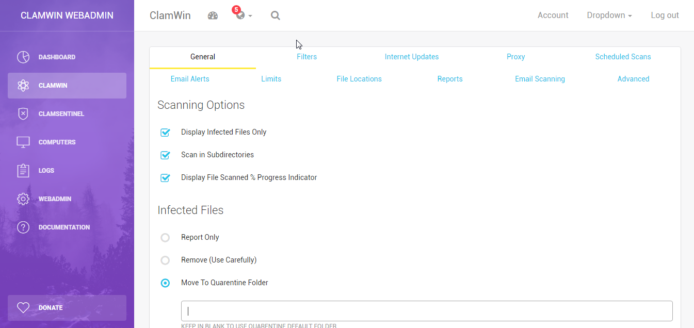

# ClamWin WebAdmin
[][CHANGELOG] [](https://github.com/coldscientist/clamwin-wa/blob/master/LICENSE)



ClamWin WebAdmin is an admin console to [ClamWin](http://www.clamwin.com/) and [ClamSentinel](http://clamsentinel.sourceforge.net/index.php?Lang=pt). 

The objective of this project is provide an admin console to manage ClamWin AV centrally. It is built on top of Bootstrap 3 and it is fully responsive.

The server exposes a REST API that the ClamWinCli client (available at **clients** folder) queries for information. The client is being developed in Python 2 to allow porting it to other platforms and to provide compatibility with Microsoft Windows XP and up.

**Please note that ClamWin WebAdmin is in Development stage. In other words: it is not fully functional by now.**

What works: 

+ REST API (Proxy only).
+ ClamWinCli (GetProxy and SetProxy only).

## Wish list

- DOCUMENTATION!
- Implement MySQL database to save server config.
- Manage workstations from WebAdmin (query ClamAV update version and status, quarantine, logs, etc).
- Group of workstations (e.g: allow specific config. for a group of workstations).
- Install ClamWin and ClamSentinel through WebAdmin (WMI or through ClamWinCli?)
- Implement Login page.
- Active Directory integration (e.g: Login).
- Encrypt (PKI or OAuth?) and Secure (.htaccess is enough?) REST API.
- Port ClamWinCli to run as a service.

## Special thanks go to:

+ Creative Tim for the [Light Bootstrap Dashboard](https://github.com/creativetimofficial/light-bootstrap-dashboard)
+ Jack Right for the [REST Server](https://github.com/jacwright/RestServer).

## Development Environment

You can develop it through [Visual Studio Code](https://code.visualstudio.com/download), a multiplatform and open source IDE.

### Testing WebAdmin UI and REST API

You can use [XAMPP](https://sourceforge.net/projects/xampp/) to test the WebAdmin UI and the REST API. The code doesn't require any special requirements right now, only PHP.

You can download this repository as ZIP (using the green button "Clone or download") or you can install [Git](https://git-scm.com/downloads) to clone the repo at your Apache installation:

- Clone the repo: 

```
cd C:\xampp\htdocs
git clone https://github.com/coldscientist/clamwin-webadmin.git
```

### Building Client

First, you'll need to install [Python 2](https://www.python.org/downloads/). Select the option to add Python to the $PATH variable to make easier to call it.

To develop it through Visual Studio Code, install the following extensions through Visual Studio Code **Extensions** menu (Shift+Ctrl+X):

- Python
- Python for VSCode

You don't need to build the client to test it. Just press (F5) at Visual Studio Code to launch the Debug.

You can build the client using [cx_Freeze](https://anthony-tuininga.github.io/cx_Freeze/). To install it, type the following command on Command Prompt:

```
python -m pip install cx_Freeze --upgrade
```

After installing cx_Freeze, you can build the ClamWinCli through [distutil setup script](http://cx-freeze.readthedocs.io/en/latest/distutils.html#distutils):

```
cd clients\src\clamwincli
python setup.py build
```

It will create a new directory called **build** at `clients\src\clamwincli` that holds the executable.

## License

- Copyright 2018 Eduardo Mozart de Oliveira (http://www.nethouse.inf.br)
- Licensed under GPL ([LICENSE])
